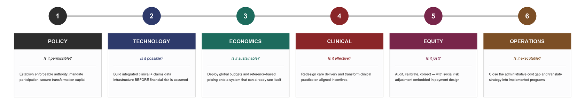

# HTR Book — Copy-Paste Markdown Templates

Paste these patterns into the manuscript Markdown to get the styled treatments.
The build (`build_docx.py`) renders them automatically. Keep the syntax **exact** —
the post-pass matches on it.

---

## Stat strip (headline numbers → navy cards)
Each stat on its own line as `**VALUE** — Label`, separated by blank lines.
```
::: {custom-style="StatStrip"}
**$2.4B** — 5-Year Deficit Projection

**108%** — Premium Increase 2018–2024

**9 of 14** — Hospitals in Loss FY2023

**57%** — Growth in 65+ by 2040
:::
```

## Callout boxes
Label line is bold; body follows. Boxes may contain bullet lists.
```
::: {custom-style="CalloutBeyond"}
**BEYOND VERMONT**

The lesson generalizes: any state that layers payment reform onto missing data infrastructure gets the same cascade.
:::
```
```
::: {custom-style="CalloutWorked"}
**WORKED EXAMPLE — Hospital CFO under a voluntary ACO**

Imagine you are the CFO of a Vermont hospital generating $40M from inpatient admissions…
:::
```
```
::: {custom-style="CalloutTry"}
**TRY THIS — Reproduce the OneCare cascade.**

Open the **HTR Simulator** (`/htr-simulator`) and build a profile with strong Economics but weak Technology…
:::
```
```
::: {custom-style="CalloutKey"}
**KEY NUMBERS**

**5.8:1** — Blueprint ROI

**91%** — Primary care access
:::
```
```
::: {custom-style="CalloutVT"}
**VERMONT IN PRACTICE — The $400M Savings Estimate**

Oliver Wyman projected more than $400M in direct savings over five years…

- Close unsustainable inpatient facilities
- Reduce administrative costs
:::
```
Variants of `CalloutVT` (just change the label text): `VERMONT EVIDENCE`, `GO DEEPER — HTR Academy`.

## Banner (one punchy thesis line)
```
::: {custom-style="Banner"}
Vermont is not an outlier. It is a preview.
:::
```

## Pull-quote + attribution
```
::: {custom-style="PullQuote"}
"If the model is not adequately regulated and sufficiently resourced, it will fail dramatically."
:::
::: {custom-style="QuoteAttr"}
— Owen Foster, Chair, Green Mountain Care Board, January 2025
:::
```

## Epigraph (section opener)
```
::: {custom-style="Epigraph"}
You cannot manage what you cannot measure.
:::
```

## Tables (auto-styled: navy header, full width, content-fit columns)
Use normal Markdown pipe tables. Always add a caption line right after:
```
| Pillar | Diagnostic question | Structural role |
| :---- | :---- | :---- |
| Policy | Is it permissible? | The mandatory architecture. |

*Table X.Y — Caption text. Source: …*
```
For tables whose cells need **bullet lists**, use a Pandoc **grid table** (see the
Layer tables in the manuscript for the exact form) — pipe tables can't hold bullets.

## Key Concepts (auto-styled — just use bold term + definition)
```
## **Key Concepts in This Chapter**

**Dependency logic**
The principle that some pillar investments cannot produce results until upstream investments are in place.

**Execution sequence**
The order in which the six pillars must be built: Policy, Technology, Economics, Clinical, Equity, Operations.
```
(The build renders the term blue-bold-10pt and the definition 9pt automatically.)

## Sources (auto-styled small italic)
```
## **Sources**

Vermont Agency of Human Services, Health Care System Transformation Report (November 2025); Oliver Wyman, Act 167 Recommendations (2024); …
```

## Platform + Academy tie-ins (the book's selling point — use generously)
- Link a tool by its real path (verify against `frontend/lib/taxonomy/tools.ts`):
  `**HTR Simulator** (\`/htr-simulator\`)`, `**FHIR Lab** (\`/research-lab/interoperability?tab=fhir\`)`.
- Point readers to a course with a `CalloutVT` "GO DEEPER — HTR Academy" box naming
  the course (e.g. Value-Based Care, Population Health, Health Equity).

## Sequence/diagram graphics
Reference an image generated into `book-build/`:
```


*Figure X.Y — Caption.*
```
Generate/edit the graphic in `make_sequence_graphic.py` (Pillow).
